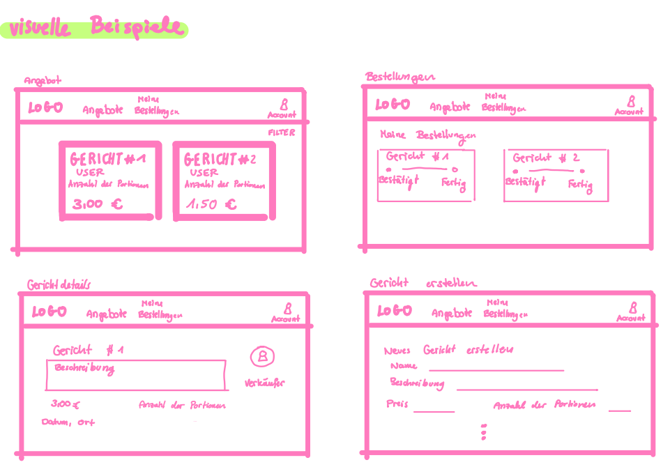

{: .no_toc }
# Value Proposition

Table of contents

+ ToC
{: toc }
{: .text-delta }

## The Problem

Cooking in student dormitories is time-consuming, expensive, and often leads to unnecessary food waste. Since students typically cook small portions just for themselves, they end up paying more for smaller package sizes at the supermarket. A poor trade-off that rarely feels worth the effort. As a result, many students fall back on unhealthy convenience foods or expensive delivery services like UberEats and Wolt, spending money they don't have on meals that don't satisfy.

## Our Solution

Kochbörse is a web-based platform that connects students within the same dormitory. Students who enjoy cooking can offer and sell extra portions of their home-cooked meals. Students who don't want to cook can browse nearby listings and pick up fresh, affordable food, that is made by fellow students, right where they live.
The app allows users to register, create weekly meal plans, list dishes for sale, and browse available offers. It is designed to be simple and accessible: find a meal, place an order, pick it up from down the hall.
Kochbörse does not promise restaurant-quality logistics or a full marketplace infrastructure. It is a lightweight community tool built specifically for dormitory life: reducing waste, enabling a small side income for cooks, and making it easier for everyone to eat well on a student budget.

## Target User(s)

Kochbörse serves two types of users within the same dormitory community.
The Cook – e.g., Lars, 22
Lars enjoys cooking and often prepares larger meals anyway. He wants to offset the cost of ingredients by selling extra portions to neighbors. He is tech-savvy, motivated to learn how web applications are built, and values the social aspect of connecting with other students in his dorm.
The Buyer – e.g., Julia, 21
Julia is busy with coursework and has little motivation to cook after long days. She wants a quick, affordable, and reasonably healthy meal without the premium cost of delivery apps. She doesn't need many features, but just a clear list of what's available nearby and an easy way to grab it.
Both personas live in the same building, which is what makes the platform viable: no delivery logistics, no distance, just neighbors helping neighbors.

##  Happy Path

Registration — A new user signs up with their university email and selects their dormitory.
Browse — The buyer opens the app and sees a feed of available meals offered by cooks in their building, including dish name, price, portion count, and pickup time.
Order — The buyer selects a meal and confirms their interest with one tap.
Cook notified — The cook receives the order and confirms availability.
Pickup — The buyer picks up the meal directly from the cook's room or a designated common area in the dorm.
Done — Both users can rate the interaction, building trust within the community.

This path is consistent with what the app delivers: a simple peer-to-peer meal exchange within a single dormitory, without payment processing complexity or delivery infrastructure.
---

## Target Scope

The submitted web app covers the following core screens and features:

Landing / Login page — Entry point with registration and login for new and returning users.
Home / Feed — A browsable list of currently available meals in the user's dormitory, filterable by meal type or time.
Meal listing (Cook view) — A form for cooks to post a dish, set a price, define portion count, and specify pickup time.
Weekly plan (Cook view) — A simple weekly calendar where cooks can plan and announce upcoming meals in advance.
Order confirmation (Buyer view) — A detail page for a selected meal with a confirm button.
Profile page — Basic user info, past activity, and ratings.

The scope deliberately excludes in-app payments, real-time chat, and delivery tracking — these were identified early as out of scope given the team's learning goals and project timeline.

