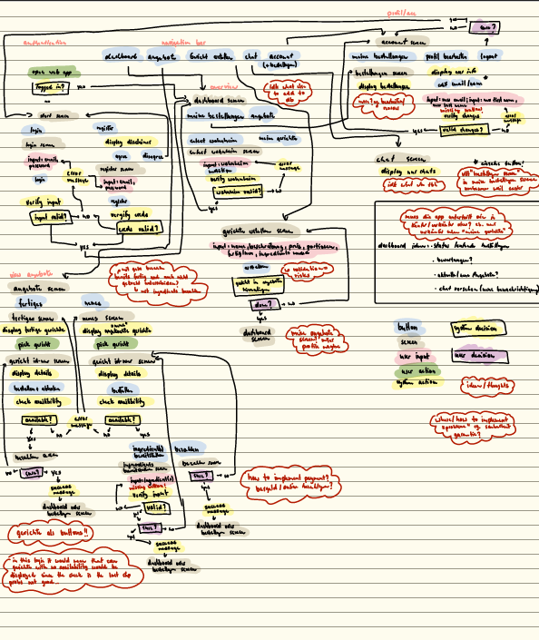
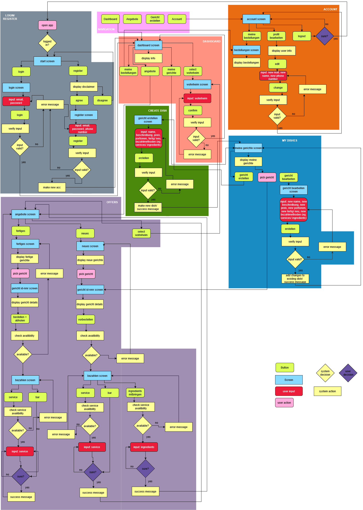

{: .no_toc }
# Data Model

Table of contents

+ ToC
{: toc }
{: .text-delta }

# Flowchart - Draft  

To clearly define the project's scope and ensure a shared understanding of how Dorm & Dine will function, we mapped out a tentative but comprehensive user flow diagram (Ablaufdiagramm).

The diagram serves as our structural foundation, guiding both our user interface design and our backend development priorities. It was purposefully created to visually map the users journey and help us identify which screens, user inputs, and background system actions are mandatory for a serviceable user experience. Using this flow we are able to pinpoint open design decisions and look for appropriate solutions. 

# Flowchart - Draft Rework 

notes: 
-chat feature removed  
-edit dish option added  
-my dish screen added  
-rework of payment options  
-changed some user inputs  

